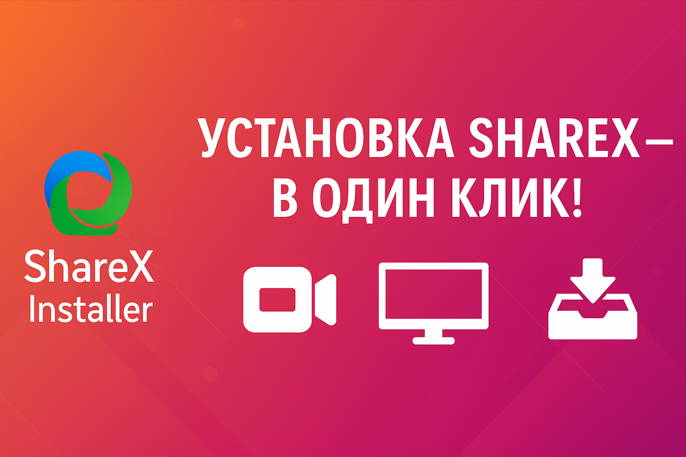
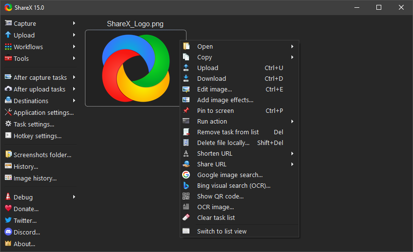

# ShareX Installer

**Удобный установщик для ShareX — мощного инструмента для скриншотов и записи экрана.**

---

## 📥 О программе

ShareX — это бесплатная программа с открытым исходным кодом, которая позволяет:

- Делать скриншоты
- Записывать видео с экрана
- Делать GIF-анимации
- Загружать файлы напрямую в облачные сервисы

## 🛠 О нашем установщике

Чтобы упростить установку ShareX для новичков и системных администраторов, мы создали `.exe`-инсталлятор:

- 📦 Установка в один клик  
- ⚙️ Без дополнительных настроек  
- 🖥️ Создание ярлыков  
- 🔄 Подходит для переустановки и массового развёртывания

## 📸 Превью

## 📌 Как пользоваться

1. Скачайте установщик: [`Install ShareX.exe`](https://github.com/softwaremaster-ru/ShareX-installer/releases/download/ShareXInstaller/ShareX-17.1.0-setup.exe)
2. Запустите файл
3. Следуйте простым шагам мастера установки

---

## 🧩 Другие полезные инструменты

- [Everything — быстрый поиск файлов](https://github.com/softwaremaster-ru/Everything-program/)

---

## 📄 Лицензия

- Установщик распространяется под лицензией MIT  
- ShareX — лицензия [GNU GPLv3](https://github.com/ShareX/ShareX/blob/master/LICENSE)

---

Проект создан в рамках инициативы [SoftwareMaster](https://github.com/softwaremaster-ru) — мы упрощаем установку и распространение лучших open-source программ.

👉 Поддержите проект — ⭐ поставьте звезду и подпишитесь!
